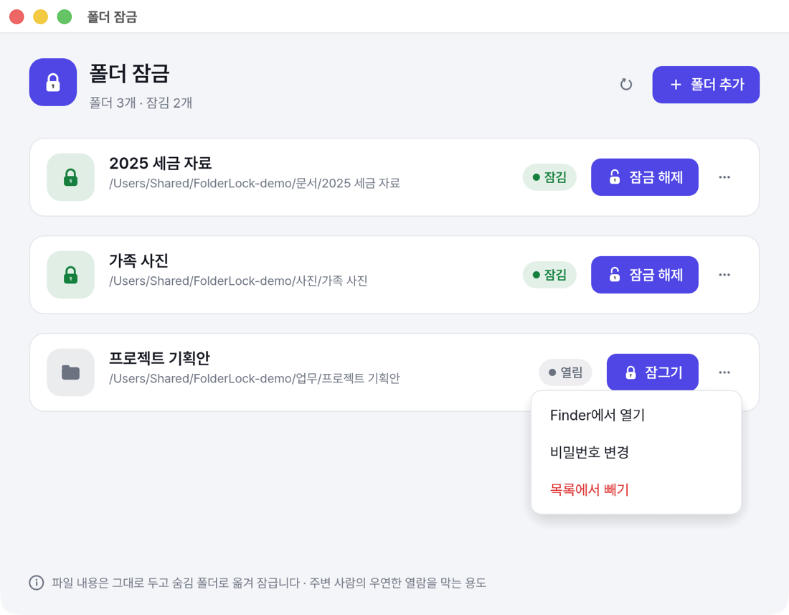
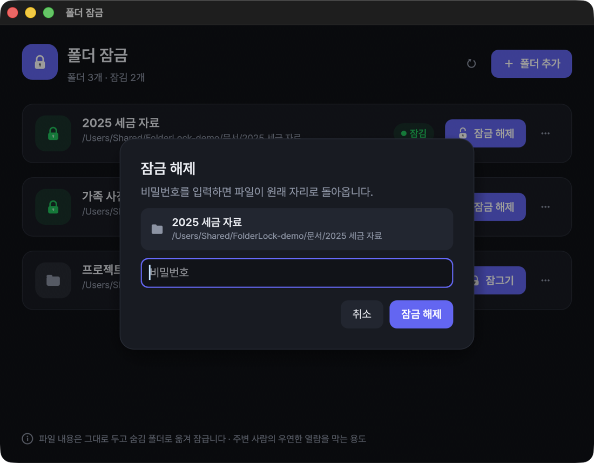

# 폴더 잠금 (FolderLock)

등록한 폴더를 버튼 하나로 잠그고, 비밀번호로 푸는 Windows·macOS 앱.
잠그면 폴더 안에는 **잠금 해제 입구 하나만** 보이고, 원래 파일은 숨김 보관 폴더로 옮겨져 열람·삭제가 막힙니다.

> A simple folder locker for Windows and macOS. Files are never copied, encrypted or rewritten —
> they are only renamed into a hidden, access-denied vault, so a crash can never lose data.

<p align="center">
  
  
</p>

## 특징
- **파일을 잃지 않는 설계** — 복사·암호화·덮어쓰기 없이 같은 드라이브 안에서 이름만 바꿔 옮깁니다.
  어느 단계에서 강제 종료·정전이 나도 모든 파일은 원래 자리나 보관 폴더 중 한 곳에 온전히 있고,
  다음 실행 때 하던 작업을 마저 끝냅니다. 이 성질은 **모든 단계에 강제 종료를 주입하는 자동 테스트**로 검증합니다.
- **빠름** — 수 GB 폴더도 이름만 바꾸므로 거의 즉시 잠기고 풀립니다.
- **폴더 안에서 바로 풀기** — 잠긴 폴더 안의 `잠금 해제.exe`(Windows) / `잠금 해제.app`(macOS)을 열면 비밀번호 창이 뜹니다.
- **위험한 폴더는 거부** — 드라이브 전체, 시스템 폴더, 바탕 화면·문서 폴더 자체, 클라우드 동기화 폴더, USB·네트워크 드라이브.
- 라이트/다크 모드, 설치 없이 실행 파일 하나.

## 무엇을 막고 무엇을 못 막나
**주변 사람의 우연한 열람을 막는 용도**입니다. 파일을 암호화하지 않으므로:
- 관리자 권한으로 권한을 바꾸거나, 다른 OS로 부팅하거나, 디스크를 떼어 다른 PC에 연결하면 볼 수 있습니다.
- 강한 보호가 필요하면 BitLocker·FileVault·VeraCrypt 같은 암호화 도구를 쓰세요.

| | Windows 기본 숨김 | 폴더 잠금 |
|---|---|---|
| "숨긴 항목 표시"를 켜면 | 보임 | 안 보임 |
| 보관 폴더를 열면 | 열림 | 액세스 거부 |
| 삭제·이름 바꾸기 | 됨 | 거부 |

## 다운로드
| 운영체제 | 파일 |
|---|---|
| **Windows** 10/11 (64비트) | [⬇ FolderLock-windows-x64.exe](https://github.com/jmmi/folder-lock/releases/latest/download/FolderLock-windows-x64.exe) |
| **macOS** 11 이상 (Apple Silicon·Intel) | [⬇ FolderLock-macos.zip](https://github.com/jmmi/folder-lock/releases/latest/download/FolderLock-macos.zip) |

이전 버전과 SHA-256 체크섬은 [Releases](https://github.com/jmmi/folder-lock/releases)에 있습니다.

## 설치와 사용

1. 앱 실행 → **폴더 추가** → 폴더 선택 → 비밀번호 설정
2. **잠그기** → 폴더 안에는 잠금 해제 입구만 보입니다
3. 풀 때: 앱에서 **잠금 해제**, 또는 폴더 안 잠금 해제 입구를 열고 비밀번호 입력

- Windows: 받은 exe 하나로 바로 실행. 서명이 없어 처음엔 SmartScreen에서 "추가 정보 → 실행".
- macOS: zip을 풀어 `폴더 잠금.app`을 응용 프로그램 폴더로. 처음 열 때 막히면 시스템 설정 → 개인정보 보호 및 보안 → "그래도 열기".
  폴더 안 `잠금 해제.app`은 설치된 앱을 부르는 작은 앱이라, 앱이 없는 Mac에서는 안내만 뜹니다.

> **Windows 버전은 아직 실기 테스트 전입니다.** 중요한 자료에 쓰기 전에 복사본 폴더로 먼저 시험해 주세요
> (체크리스트: [`docs/윈도우-테스트.md`](docs/윈도우-테스트.md)).

## 비밀번호를 잊었을 때
파일은 암호화되지 않았으므로 직접 되돌릴 수 있습니다.

Windows (관리자 명령 프롬프트):
```
icacls "D:\내 폴더\.folderlock" /remove:d *S-1-1-0
icacls "D:\내 폴더\.folderlock\data" /remove:d *S-1-1-0
```
그다음 `D:\내 폴더\.folderlock\data` 안의 항목을 `D:\내 폴더`로 옮기면 됩니다.

macOS (터미널):
```
chflags nouchg ~/내폴더/.folderlock && chmod 700 ~/내폴더/.folderlock
chflags nouchg ~/내폴더/.folderlock/data && chmod 700 ~/내폴더/.folderlock/data
```
그다음 `~/내폴더/.folderlock/data` 안의 항목(점으로 시작하는 파일 포함)을 `~/내폴더`로 옮기면 됩니다.

## 직접 빌드
Rust(rustup) 필요. Windows exe는 macOS에서 mingw-w64로 크로스 컴파일합니다.

```sh
cargo test                   # 엔진 결함 주입 테스트
cargo run                    # 실행 (FOLDERLOCK_THEME=light|dark 로 테마 고정 가능)
./scripts/build-windows.sh   # dist/FolderLock.exe        (brew install mingw-w64)
./scripts/build-mac.sh       # dist/폴더 잠금.app, dist/FolderLock-mac.zip (유니버설)
```

- 설정·로그: `%APPDATA%\FolderLock\` / `~/Library/Application Support/FolderLock/`
- 설계와 안전 규칙: [`docs/설계안.md`](docs/설계안.md)
- 구조: `src/engine.rs`(잠금 엔진) · `src/platform/`(OS별 이동·숨김·차단) · `src/guard.rs`(금지 폴더) · `src/ui/`(화면) · `tests/engine.rs`(강제 종료 테스트)

## 라이선스
- 코드: [MIT](LICENSE)
- 내장 글꼴 Pretendard: [SIL Open Font License 1.1](assets/fonts/OFL-Pretendard.txt) (© Kil Hyung-jin)
